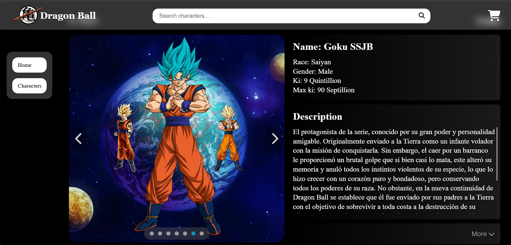

# Dragon Ball Card

This is a simple shopping cart application featuring Dragon Ball cards. The project allows users to browse, search, and view detailed information about various Dragon Ball cards. Users can also add cards to their shopping cart. Please note that this project does not include a payment feature, as it is intended for demonstration purposes only.



Live preview of the project is [here](https://dragonballcardshop.netlify.app/)

## Features

- **Search** : Easily search for Dragon Ball cards by name.
- **Product Detail View** : Click on a card to view more detailed information, including images, description, and attributes.
- **Shopping Cart** : Add your favorite cards to the shopping cart and view the selected items.
- **Cart Management** : Update the quantity or remove cards from the cart.
- **Responsive Design** : The application is optimized for various screen sizes.

## Technologies Used

- **Frontend:** React-TS, HTML, CSS Modules, SASS/SCSS, React Router.
- **Build Tool:** Vite.
- **State Management:** React Context API / React Hooks.

## Installation

To run this project locally, follow these steps:

1. **Clone the Repository**

```
git clone https://github.com/hieuhocit/shopping-cart.git
```

2. **Navigate to the Project Directory**

```
cd shopping-cart
```

3. **Install Dependencies**

```
npm install
```

4. **Run the Development Server**

```
npm run dev
```

5. **Build for Production**

```
npm run build
```

## Usage

- **Search:** Use the search bar to find specific cards by name.
- **View Details:** Click on any card to view detailed information.
- **Add to Cart:** Add cards to your shopping cart.
- **Manage Cart:** View and manage the items in your shopping cart.

## Author

This project is developed by [@hieuhocit](https://github.com/hieuhocit).
